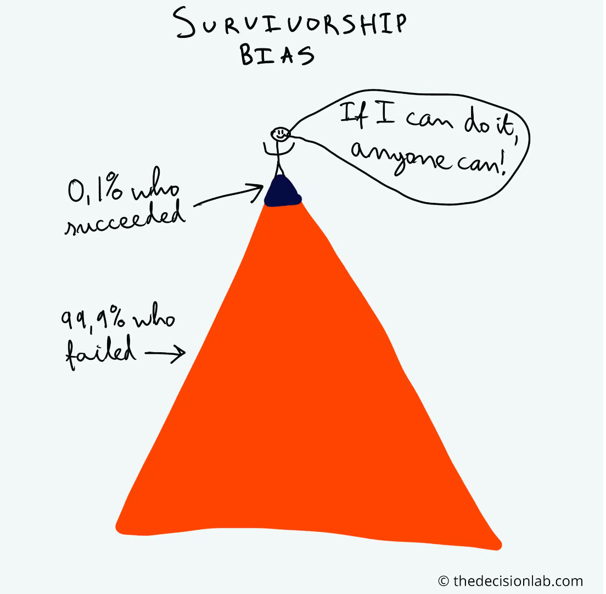

No ecossistema tecnológico de hoje, onde cada vez mais empresas nascem no paradigma "cloud-first", ou seja, já projetadas para operar em um ambiente de nuvem desde sua concepção, é crucial entender o fenômeno chamado "viés da sobrevivência". Embora este termo seja comumente usado em estatística e economia, ele tem uma aplicação surpreendente no mundo da computação em nuvem.

O viés da sobrevivência refere-se à tendência de se concentrar nos sucessos (as empresas que "sobrevivem") enquanto se ignora as falhas ou dificuldades (aquelas que "morrem"). No contexto da infraestrutura em nuvem, vemos histórias de empresas que se destacam em sua transição para a nuvem ou então seus cases de sucesso, enquanto aquelas que enfrentam desafios ou mesmo falham em sua jornada, muitas vezes não são mencionadas.

Para esclarecer o conceito, vamos a um exemplo. Considere duas startups, ambas nascidas na nuvem: a "StartUp A" e a "StartUp B". A StartUp A é frequentemente elogiada por sua implementação eficiente de serviços de nuvem que lhe permitiram escalar rapidamente, economizando custos. No entanto, a StartUp B, que também iniciou ou migrou para a nuvem, teve dificuldades devido à falta de planejamento, uma compreensão insuficiente da segurança na nuvem, ou até mesmo decisões erradas. Levando a problemas como: custos elevados, baixa resiliência e disponibilidade, problemas com privacidade, etc. todos esses prejudiciais para a reputação da empresa.

Na narrativa popular, muitas vezes ouvimos falar sobre o caso da StartUp A, enquanto a experiência da StartUp B é deixada de lado. É aqui que o viés da sobrevivência entra em jogo. Concentrar-se apenas nos sucessos cria uma imagem distorcida do que realmente significa os desafios enfrentados por empresas de tecnologia.

É fundamental entender que cada história de falha é uma oportunidade de aprendizado. Os desafios enfrentados pela StartUp B, por exemplo, podem oferecer lições valiosas sobre a importância do planejamento adequado, a necessidade de uma forte política de segurança e a compreensão dos riscos associados à nuvem (e não só a nuvem).

Além disso, é vital compreender que nem todas as infraestruturas nascem iguais na nuvem. Cada empresa tem necessidades e capacidades únicas, e o que funciona para uma pode não funcionar para outra. Portanto, é fundamental avaliar cuidadosamente as necessidades da sua empresa, seu entendimento da tecnologia em nuvem e seus recursos antes de mergulhar no ambiente da nuvem, não tente pegar o primeiro artigo legal do medium e aplicar na sua empresa sem uma profunda análise.

Em suma, enquanto celebramos os triunfos da infraestrutura em nuvem e as histórias de sucesso das empresas nascidas na nuvem, também devemos estar cientes e aprender com as falhas. O viés da sobrevivência pode ser um obstáculo para um entendimento verdadeiro e completo do que significam os desafios de uma empresa e sua infraestrutura na nuvem. Ao adotar uma abordagem mais equilibrada (entendendo os casos de sucesso e falhas), as empresas e profissionais podem se beneficiar da experiência coletiva e melhor navegar em sua jornada pela nuvem.

